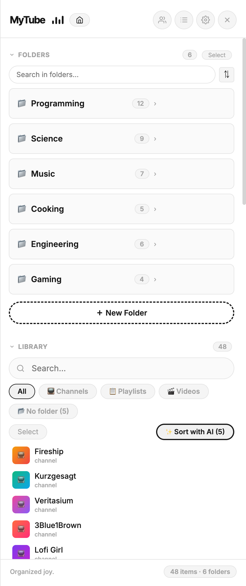
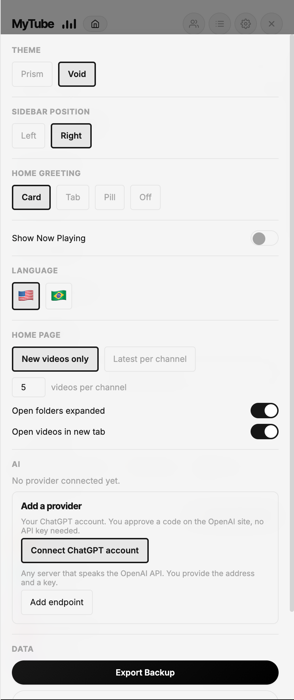
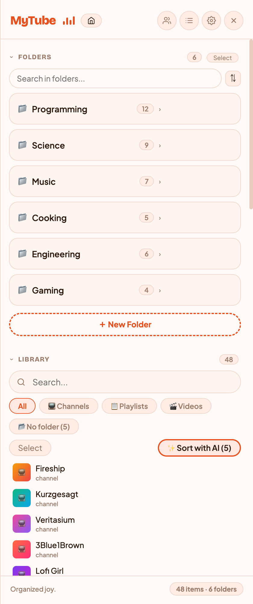
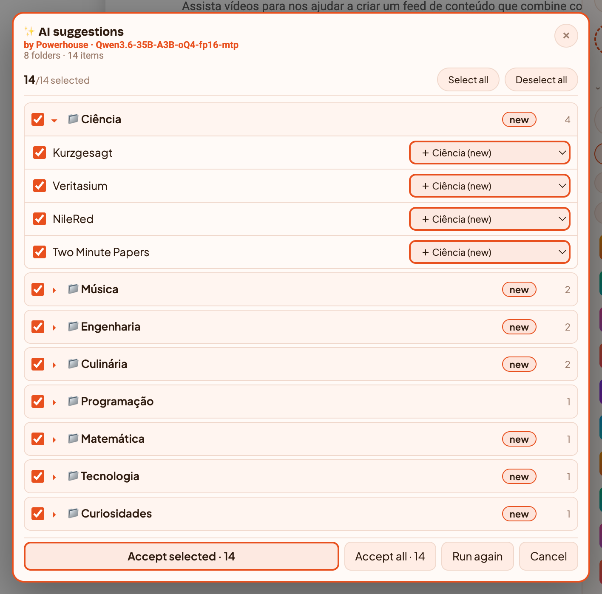

# MyTube

[](https://github.com/pedroberaldo87/MyTube/actions/workflows/ci.yml)

A Chrome extension that lets you organize your YouTube subscriptions, playlists, and videos into folders and tags — right inside YouTube.

<p align="center">
  
  
  
</p>

## Features

- **Folder hierarchy** — Organize channels, playlists, and videos into nested folders with drag-and-drop
- **Tag system** — Cross-cutting labels for flexible categorization
- **AI sorting** — Let a model propose a folder and tags for every channel and playlist you haven't filed yet. Nothing is written until you approve it — see [below](#ai-sorting-optional)
- **Home feed** — Personal home page showing new videos from all your folders, with collapsible folder/channel sections and two modes: "new only" or "latest N per channel"
- **Folder feed** — View all recent videos from a folder's channels in one page, grouped by channel
- **NEW video badges** — New uploads are highlighted with accent borders, thumbnail badges, and meta row chips
- **New video detection** — Scrapes channel pages to track new uploads with per-channel badge counts (bilingual date parsing: EN + PT-BR)
- **Mute / unmute channels** — Channels are muted by default; enable notifications only for channels you care about
- **Mark as read** — Per-channel, per-folder (recursive), or mark all
- **Hover-to-act UI** — Action buttons appear on hover for channels in folders and library items (add to folder, tag, mute, delete, unsubscribe)
- **Two themes** — Void (minimal dark) and Prism (warm colorful) with 6 accent colors
- **Sidebar on YouTube** — Opens directly inside youtube.com, left or right, toggle with ⌘/Ctrl + .
- **Smart dedup** — 4-layer channel matching (ID, URL, handle, name) prevents duplicates across YouTube's inconsistent data formats
- **Export / Import** — Full JSON backup with merge or replace modes
- **Bilingual UI** — English and Brazilian Portuguese (all pages, including feed overlays)
- **Local by default** — All your organization data stays in chrome.storage + IndexedDB. No server, no account, no tracking. If you choose to connect an AI provider in Settings, only the channel names you ask it to classify are sent to that provider — nothing else, and nothing at all until you connect one.

## AI sorting (optional)

Filing hundreds of subscriptions by hand is the boring part. Connect a model and it proposes a folder for each one — you stay the one who decides.

<p align="center">
  
</p>

**Connecting.** Open the sidebar → gear → **AI**. Two paths:

- **Your ChatGPT account** — approve a device code on openai.com. No API key involved.
- **Any OpenAI-compatible endpoint** — your own base URL and key. A local Ollama, LM Studio, vLLM, OpenRouter, or OpenAI itself. Chrome asks permission for that host on the click that saves it.

Then hit **Test connection** to pick a model.

**Sorting.** In the Library, **✨ Sort with AI** targets whatever you selected, or — with nothing selected — everything on screen that has no folder yet.

- **It suggests tags too.** Each item can get up to three, reusing your existing tags before inventing new ones. A tag you do not want goes away with one click on its chip.
- **Nothing is written until you accept.** Suggestions arrive grouped by destination folder, so a library of 800 channels is 8 decisions instead of 800. Check or uncheck a whole group or a single item, override any destination, then **Accept selected** or **Accept all**. New folders are created at that moment, never before.
- **The header names the model that produced the suggestions.** Swapping models changes the result, so the answer belongs on screen.
- **It takes a few minutes on a large library.** Items go out in batches of 20 and results stream in as each batch lands; the progress line shows the batch in flight and a running clock.

**What leaves your browser:** the names of the items being classified and the names of your existing folders. Nothing else — no watch history, no video data, no identifiers. And nothing at all until you connect a provider yourself.

## Install in Chrome

MyTube is not on the Chrome Web Store — you build it and load it yourself. Takes about two minutes.

**You need:** [Node.js](https://nodejs.org) 20 or newer (`node -v` to check), git, and Chrome.

### 1. Build it

```bash
git clone https://github.com/pedroberaldo87/MyTube.git
cd MyTube
npm install
npm run build
```

This creates a `dist/` folder. **That folder is the extension** — the repository root is not.

### 2. Load it into Chrome

1. Open a new tab and go to **`chrome://extensions`** (typing it in the address bar; it will not open from a link).
2. Turn on **Developer mode** — the toggle sits in the **top right** corner.
3. Three buttons appear at the top left. Click **Load unpacked**.
4. In the file picker, navigate into the cloned folder and select **`dist`**. Select the folder itself; do not open it and pick a file inside.

MyTube now appears in the list with a version number. If Chrome shows an error instead, the build did not finish — re-run `npm run build` and read its output.

### 3. Pin it to the toolbar

Chrome hides new extensions behind the puzzle-piece icon. Click the puzzle piece, find **MyTube**, and click the pin next to it. The icon now sits next to the address bar — that icon is how you open the sidebar.

### 4. First run

1. Go to **youtube.com** (reload the tab if you already had it open — content scripts only attach on load).
2. Click the **MyTube** icon. The sidebar slides in from the right. **⌘ + .** (macOS) or **Ctrl + .** toggles it too.
3. Click **Subs** in the sidebar header to import your subscriptions, and **Lists** for your playlists.
4. Create a folder and drag channels into it — or let [AI sorting](#ai-sorting-optional) propose the whole structure.

### Updating

```bash
git pull
npm run build
```

Then open `chrome://extensions` and click the **↻ reload** icon on the MyTube card. Your folders and tags live in the browser's own storage and survive the update.

### If something goes wrong

| Symptom | Cause |
|---|---|
| The icon does nothing on youtube.com | The tab was open before you installed. Reload it |
| Chrome refuses the folder | You selected the repository root instead of `dist/` |
| The card shows "Errors" | The build failed. Run `npm run build` and read the output |
| Everything vanished after an update | Chrome dropped the unpacked extension (it does this if `dist/` moved). Load unpacked again — your data is in browser storage, not in `dist/` |

## Permissions

Chrome will show you a broad-sounding list. Here is what each entry is actually for, and what is **not** granted at install:

| Permission | Why |
|---|---|
| `storage`, `unlimitedStorage` | Your folders, tags and watch history, in the browser. `unlimitedStorage` only lifts the 5 MB quota — a large library exceeds it |
| `tabs` | One call: telling the sidebar to open when you click the toolbar icon |
| `alarms` | Scheduling the check for new uploads |
| `https://www.youtube.com/*` | The sidebar itself — it is a content script injected into YouTube |
| `https://auth.openai.com/*`, `https://chatgpt.com/backend-api/*` | Only exercised if you connect a ChatGPT account: the device-code flow and the inference endpoint |

**About `optional_host_permissions: ['https://*/*', 'http://*/*']`** — this is the entry that looks alarming, and it is deliberate. It grants **nothing** at install: it is a declaration of what MyTube is *allowed to ask for later*. Because you can point the AI at any endpoint you like — a local Ollama, a machine on your LAN, a hosted API — the manifest cannot know the address in advance. Chrome only lets an extension request a host it declared, so declaring broad is what makes it possible to request **narrow**: one specific origin, on the click that saves that endpoint, with Chrome's own dialog. Nothing is requested until then, and nothing else is ever requested.

## Development

```bash
npm run build       # type-check + build into dist/
npm run typecheck   # types only
npm test            # test suite (node:assert, no framework)
npm run package     # build + zip for distribution
npm run dev         # Vite dev server (dashboard page only, not the extension)
```

Tests run against real code — several drive a real Chromium via Playwright and assert on what is actually rendered. `build.ts` is the real build entry point, not `vite.config.ts`.

## Tech Stack

Preact &middot; TypeScript &middot; Vite &middot; Chrome Extension Manifest V3 &middot; IndexedDB (via idb)

## License

This project is licensed under the [GNU General Public License v3.0](LICENSE).

MyTube - Chrome extension to organize YouTube with folders and tags
Copyright (C) 2025 Pedro Beraldo

---

## 🇧🇷 Portugues

Uma extensao do Chrome que permite organizar suas inscricoes, playlists e videos do YouTube em pastas e tags — direto dentro do YouTube.

### Funcionalidades

- **Pastas hierarquicas** — Organize canais, playlists e videos em pastas aninhadas com drag-and-drop
- **Sistema de tags** — Etiquetas transversais para categorizacao flexivel
- **Organizacao por IA** — Deixe um modelo propor uma pasta e tags para cada canal e playlist que ainda nao foi arquivado. Nada e gravado ate voce aprovar — veja [abaixo](#organizacao-por-ia-opcional)
- **Home feed** — Pagina inicial pessoal com videos novos de todas as pastas, secoes colapsaveis por pasta/canal, dois modos: "so novos" ou "ultimos N por canal"
- **Feed de pasta** — Veja todos os videos recentes dos canais de uma pasta em uma pagina, agrupados por canal
- **Badges de video novo** — Uploads novos destacados com borda accent, badge na thumbnail e chip na linha de metadados
- **Deteccao de videos novos** — Scraping de paginas de canais para acompanhar novos uploads com contagem de badges por canal (parsing de datas bilingue: EN + PT-BR)
- **Silenciar / ativar canais** — Canais entram silenciados por padrao; ative notificacoes apenas nos canais que importam
- **Marcar como lido** — Por canal, por pasta inteira (recursivo), ou marcar tudo
- **UI hover-to-act** — Botoes de acao aparecem no hover para canais nas pastas e itens da biblioteca (adicionar a pasta, tag, silenciar, excluir, desinscrever)
- **Dois temas** — Void (minimalista escuro) e Prism (colorido quente) com 6 cores de destaque
- **Sidebar no YouTube** — Abre direto dentro do youtube.com, esquerda ou direita, toggle com ⌘/Ctrl + .
- **Dedup inteligente** — 4 camadas de matching de canais (ID, URL, handle, nome) evita duplicatas
- **Exportar / Importar** — Backup completo em JSON com modos merge ou replace
- **Interface bilingue** — Ingles e Portugues Brasileiro (todas as paginas, incluindo overlays de feed)
- **Local por padrao** — Todos os seus dados de organizacao ficam em chrome.storage + IndexedDB. Sem servidor, sem conta, sem rastreamento. Se voce optar por conectar um provedor de IA nas configuracoes, so os nomes dos canais que voce mandar classificar sao enviados a ele — nada alem disso, e nada ate voce conectar.

### Organizacao por IA (opcional)

Arquivar centenas de inscricoes na mao e a parte chata. Conecte um modelo e ele propoe uma pasta para cada uma — quem decide continua sendo voce.

<p align="center">
  
</p>

**Conectar.** Abra a sidebar → engrenagem → **IA**. Dois caminhos:

- **Sua conta ChatGPT** — voce aprova um codigo no site da OpenAI. Sem chave de API.
- **Qualquer endpoint compativel com a API da OpenAI** — voce informa a URL base e a chave. Um Ollama local, LM Studio, vLLM, OpenRouter, ou a propria OpenAI. O Chrome pede permissao para aquele host no clique que salva.

Depois use **Testar conexao** para escolher o modelo.

**Organizar.** Na Biblioteca, **✨ Organizar com IA** age sobre o que voce selecionou, ou — sem selecao — sobre tudo que esta na tela e ainda nao tem pasta.

- **Ele sugere tags tambem.** Ate tres por item, reusando as tags que voce ja tem antes de inventar nome novo. Tag que voce nao quer sai com um clique no chip.
- **Nada e gravado ate voce aceitar.** As sugestoes chegam agrupadas por pasta de destino, entao uma biblioteca de 800 canais vira 8 decisoes em vez de 800. Marque ou desmarque um grupo inteiro ou um item so, troque qualquer destino, e entao **Aceitar marcados** ou **Aceitar tudo**. Pastas novas nascem nesse momento, nunca antes.
- **O cabecalho diz qual modelo produziu as sugestoes.** Trocar de modelo muda o resultado, entao a resposta tem que estar na tela.
- **Leva alguns minutos numa biblioteca grande.** Os itens saem em lotes de 20 e os resultados vao aparecendo conforme cada lote volta; a linha de progresso mostra o lote em voo e um relogio correndo.

**O que sai do seu navegador:** os nomes dos itens sendo classificados e os nomes das suas pastas. Nada alem disso — nem historico, nem dados de video, nem identificadores. E nada ate voce mesmo conectar um provedor.

### Instalar no Chrome

O MyTube nao esta na Chrome Web Store — voce mesmo faz o build e carrega. Leva uns dois minutos.

**Voce precisa de:** [Node.js](https://nodejs.org) 20 ou mais novo (`node -v` para conferir), git e o Chrome.

#### 1. Fazer o build

```bash
git clone https://github.com/pedroberaldo87/MyTube.git
cd MyTube
npm install
npm run build
```

Isso cria uma pasta `dist/`. **Essa pasta e a extensao** — a raiz do repositorio nao e.

#### 2. Carregar no Chrome

1. Abra uma aba nova e va em **`chrome://extensions`** (digitando na barra de endereco; nao abre por link).
2. Ligue o **Modo do desenvolvedor** — o botao fica no canto **superior direito**.
3. Aparecem tres botoes no canto superior esquerdo. Clique em **Carregar sem compactacao**.
4. No seletor de arquivos, entre na pasta clonada e selecione **`dist`**. Selecione a pasta em si; nao entre nela para escolher um arquivo.

O MyTube aparece na lista com um numero de versao. Se o Chrome mostrar erro, o build nao terminou — rode `npm run build` de novo e leia a saida.

#### 3. Fixar na barra

O Chrome esconde extensao nova atras do icone de quebra-cabeca. Clique no quebra-cabeca, ache o **MyTube** e clique no alfinete ao lado. O icone passa a ficar junto da barra de endereco — e por ele que a sidebar abre.

#### 4. Primeiro uso

1. Va no **youtube.com** (recarregue a aba se ela ja estava aberta — content script so entra no carregamento).
2. Clique no icone do **MyTube**. A sidebar entra pela direita. **⌘ + .** (macOS) ou **Ctrl + .** tambem alterna.
3. Clique em **Canais** no cabecalho da sidebar para importar suas inscricoes, e em **Listas** para as playlists.
4. Crie uma pasta e arraste canais para dentro — ou deixe a [organizacao por IA](#organizacao-por-ia-opcional) propor a estrutura inteira.

#### Atualizar

```bash
git pull
npm run build
```

Depois abra `chrome://extensions` e clique no icone **↻ recarregar** no card do MyTube. Suas pastas e tags ficam no armazenamento do proprio navegador e sobrevivem a atualizacao.

#### Se der errado

| Sintoma | Causa |
|---|---|
| O icone nao faz nada no youtube.com | A aba ja estava aberta antes da instalacao. Recarregue |
| O Chrome recusa a pasta | Voce selecionou a raiz do repositorio em vez de `dist/` |
| O card mostra "Erros" | O build falhou. Rode `npm run build` e leia a saida |
| Sumiu tudo depois de atualizar | O Chrome descartou a extensao sem compactacao (acontece se `dist/` mudou de lugar). Carregue de novo — seus dados estao no armazenamento do navegador, nao em `dist/` |

### Permissoes

O Chrome mostra uma lista de aparencia ampla. O que cada item faz de fato, e o que **nao** e concedido na instalacao:

| Permissao | Para que |
|---|---|
| `storage`, `unlimitedStorage` | Suas pastas, tags e historico, no navegador. O `unlimitedStorage` so tira o teto de 5 MB — biblioteca grande passa disso |
| `tabs` | Uma chamada: mandar a sidebar abrir quando voce clica no icone |
| `alarms` | Agendar a checagem de uploads novos |
| `https://www.youtube.com/*` | A propria sidebar — ela e um content script injetado no YouTube |
| `https://auth.openai.com/*`, `https://chatgpt.com/backend-api/*` | So sao usados se voce conectar uma conta ChatGPT: o device flow e o endpoint de inferencia |

**Sobre `optional_host_permissions: ['https://*/*', 'http://*/*']`** — e o item que assusta, e ele e proposital. Nao concede **nada** na instalacao: e a declaracao do que o MyTube *pode vir a pedir*. Como voce aponta a IA para o endpoint que quiser — um Ollama local, uma maquina da sua rede, uma API hospedada — o manifest nao tem como saber o endereco de antemao. O Chrome so deixa uma extensao pedir host que ela declarou, entao declarar amplo e o que torna possivel pedir **estreito**: uma origem especifica, no clique que salva aquele endpoint, com o dialogo do proprio Chrome. Nada e pedido antes disso, e nada alem disso e pedido.

### Desenvolvimento

```bash
npm run build       # type-check + build em dist/
npm run typecheck   # so os tipos
npm test            # suite de testes (node:assert, sem framework)
npm run package     # build + zip para distribuicao
npm run dev         # servidor Vite (so a pagina do dashboard, nao a extensao)
```

Os testes rodam contra codigo real — varios dirigem um Chromium de verdade via Playwright e afirmam sobre o que e efetivamente renderizado. O `build.ts` e o ponto de entrada real do build, nao o `vite.config.ts`.

### Licenca

Este projeto esta licenciado sob a [GNU General Public License v3.0](LICENSE).
